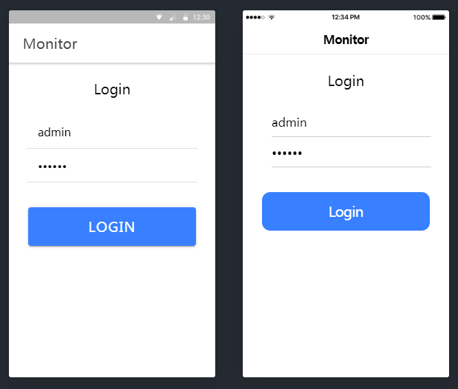

# ionic-monitor-app
ionic4-angular7


## Install NPM Dependencies
Once you clone this repository, run this command on your terminal to install all needed dependencies:
```sh
$ npm install
```

## Install cordova plugin Dependencies
Run this command on your terminal to add a platform and install all needed puglins:

iOS:
```sh
$ ionic cordova platform add ios
$ ionic cordova run ios

$ ionic cordova build ios
```

Android:
```sh
$ ionic cordova platform add android
$ ionic cordova run android

$ ionic cordova build android
```
## Launching the App
After installing the needed dependencies you are done, launch your app with a simple
```sh
$ ionic serve
```
## App Preview


- **Login**




- **Home**


- **Alarm**

